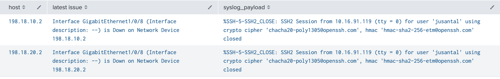
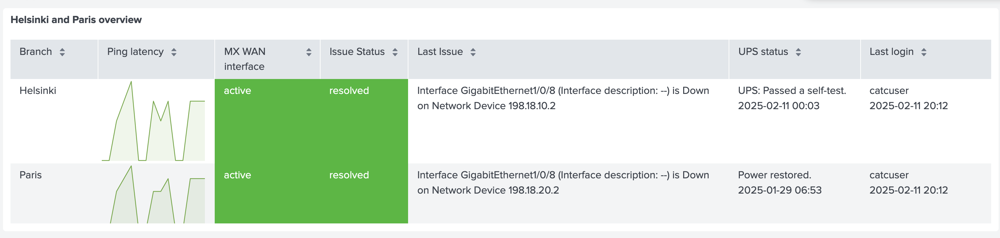

# SPL examples

Please refer to the following to get started with building your own Splunk dashboard. Note that the way you refer to data depends on what data inputs you have configured, therefor the examples might not work directly for you.

## Create a simple table listing the last Catalyst Center Assurance alert per site, with human-readable timestamps.

```
index=catc alert 
|  eval Time = strftime(_time, "%Y-%m-%d %H:%M") 
|  stats latest("details.Assurance Issue Details") latest(Time) by "details.Device"
```

## Predict graph for Paris ThousandEyes data


```
sourcetype="cisco:thousandeyes:api:json" url="*cisco*"
| spath path=results{} output=results
| mvexpand results
| spath input=results

| rename agent.agentId as agentId 
| eval Branch=if(agentId="10", "Paris", if(agentId="4739", "Helsinki", "unknown")) 
| search Branch="Paris"

| timechart span=10m avg(healthScore) as Health 
| predict "Health" as "Predicted healthscore"
```

Note that for this demo, the agentId was hardcoded to either Paris or Helsinki in the `eval Branch=if(agentId="10", "Paris", if(agentId="4739", "Helsinki", "unknown"))`

## Simple `join`ed table

This table combines data from Catalyst Center webhooks and IOS XE syslog. `join` command is used to join the different data together, and in the end a table is defined to present the desired data.



```
source="http:Catalyst Center events"
| stats latest("details.Assurance Issue Name") as "latest issue" by details.Device 
| rename details.Device as host
| join host
    [search index=iosxe]

| table host "latest issue" syslog_payload
```

Note how the details.Device has been renamed as "host" to match to the field used in the syslog message.

## More advanced `join`ed table
This table combines data from multiple sources: Meraki, Catalyst Center, ISE, and external resources. `join` command is used to join the different data together, and in the end a table is defined to present the desired data.



```
index="meraki" source="http:Meraki events"
| chart sparkline(avg(message.results.latencies.average)) as "Ping latency" by message.request.serial 
| rename message.request.serial as Serial 
| eval Branch=if(Serial="Q2EW-NGY4-9YZP", "Helsinki", if(Serial="Q2EW-NHQT-2DM6", "Paris", "unknown")) 
| join Branch
    [search index="ups" | eval Time = strftime(_time,"%Y-%m-%d %H:%M")
    | stats latest(payload) as Status latest(Time) as Time by devicename 
    | eval "UPS status"=mvappend(Status, Time) 
    | eval Branch=if(devicename="ups-helsinki", "Helsinki", "Paris")
    ] 
| join Branch 
    [search index="ise" CISE_Passed_Authentications
    | eval Time = strftime(_time,"%Y-%m-%d %H:%M")
    | stats latest(src_user) as User latest(Time) as Time by NetworkDeviceName 
    | eval "Last login"=mvappend(User, Time) 
    | eval Branch=if(NetworkDeviceName="c9000v-helsinki", "Helsinki", if(NetworkDeviceName="c9000v-paris", "Paris","unknown")) 
    ] 
| join Branch 
    [search serial IN(Q2YN-GLP3-HJAB, Q2PN-NH3Z-777K)
    | spath "uplinks{}.interface" 
    | spath "uplinks{}.status"
    | search "uplinks{}.interface"=wan1
    | stats latest("uplinks{}.status") as "MX WAN interface" by serial 
    | eval Branch=if(serial="Q2YN-GLP3-HJAB", "Helsinki", "Paris")
    ] 
| join Branch 
    [search index=catc 
    | stats latest("details.Assurance Issue Status") as "Issue Status", latest("details.Assurance Issue Name") as "Last Issue" by details.Device 
    | rename details.Device as Device 
    | eval Branch=if(Device="198.18.10.2", "Helsinki", if(Device="198.18.20.2", "Paris", "unknown"))
    ] 

| table Branch, "Ping latency", "MX WAN interface", "Issue Status",  "Last Issue", "UPS status", "Last login"
```

Note how `Branch` is used as the combining column for all of the searches in this table.